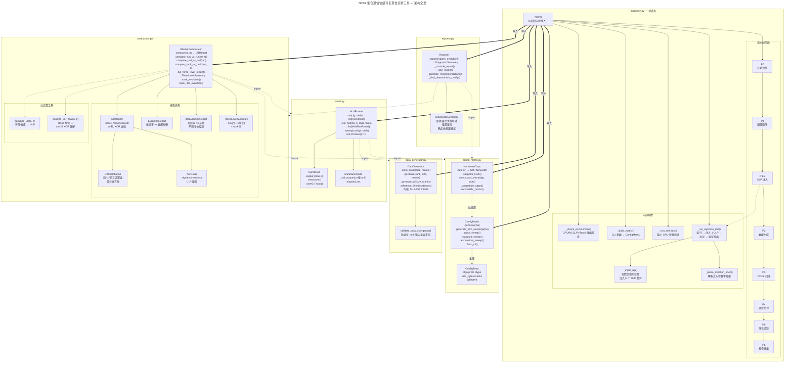
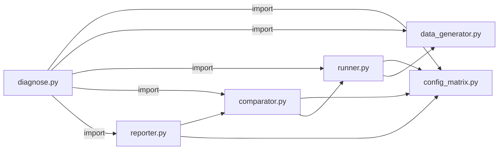

# 架构图 — 模块、类与方法

```mermaid
---
title: NCCL 集合通信位级可复现性诊断工具 — 架构全景
---
graph TD
    %% ═══════════════ 调度器 — diagnose.py ═══════════════
    subgraph D["diagnose.py — 调度器"]
        direction TB
        MAIN["main()<br/>8 阶段流水线入口"]
        subgraph DP["流水线阶段"]
            direction LR
            P0["P0<br/>环境预检"]
            P1["P1<br/>配置矩阵"]
            P15["P1.5<br/>ULP 注入"]
            P2["P2<br/>数据生成"]
            P3["P3<br/>NCCL 扫描"]
            P4["P4<br/>逐位比对"]
            P5["P5<br/>演化追踪"]
            P6["P6<br/>报告输出"]
        end
        subgraph DU["内部函数"]
            ENV["_check_environment()<br/>GPU/NCCL/PyTorch 就绪检查"]
            BUILD["_build_matrix()<br/>CLI 参数 → ConfigMatrix"]
            SELF["_run_self_test()<br/>最小 GPU 冒烟测试"]
            INJECT["_run_injection_test()<br/>运行 → 注入 1 ULP →<br/>比对 → 验证检出"]
            INJULP["_inject_ulp()<br/>在数组指定位置<br/>注入 N 个 ULP 差异"]
            INJPARSE["_parse_injection_spec()<br/>解析注入参数字符串"]
        end
        MAIN --> P0 --> P1 --> P15 --> P2 --> P3 --> P4 --> P5 --> P6
        MAIN --> ENV
        MAIN --> BUILD
        MAIN --> SELF
        MAIN --> INJECT
        INJECT --> INJULP
        INJECT --> INJPARSE
        P15 -.-> INJECT
    end

    %% ═══════════════ config_matrix.py ═══════════════
    subgraph C["config_matrix.py"]
        HW["HardwareCaps<br/>.detect() → SM / NVSwitch<br/>.supports_ll128()<br/>.check_and_warn(algo, proto)<br/>.compatible_algos()<br/>.compatible_protos()"]
        CM["ConfigMatrix<br/>.generate(hw)<br/>.generate_with_warnings(hw)<br/>.quick_sweep()<br/>.standard_sweep()<br/>.exhaustive_sweep()<br/>.from_cli()"]
        CE["ConfigEntry<br/>algo  proto  dtype<br/>size_bytes  nranks<br/>collective"]
        HW -.->|"过滤用"| CM
        CM -->|"生成"| CE
    end

    %% ═══════════════ data_generator.py ═══════════════
    subgraph G["data_generator.py"]
        DG["DataGenerator<br/>.elem_count(size, nranks)<br/>.generate(rank, size, nranks)<br/>.generate_all(size, nranks)<br/>.reference_allreduce(inputs)<br/>内核: SHA-256 PRNG"]
        VAL["validate_data_divergence()<br/>验证各 rank 输入是否不同"]
        DG --> VAL
    end

    %% ═══════════════ runner.py ═══════════════
    subgraph R["runner.py"]
        RNR["NcclRunner<br/>.run(cfg, trials) → list[RunResult]<br/>.run_full(cfg, n_calls, trials)<br/>  → list[MultiRunResult]<br/>.sweep(configs, trials)<br/>mp.Process() × N"]
        RR["RunResult<br/>.output (rank-0)<br/>.checksum()<br/>.save() / .load()"]
        MRR["MultiRunResult<br/>.call_outputs[call][rank]<br/>.elapsed_ms"]
        RNR --> RR
        RNR --> MRR
    end

    %% ═══════════════ comparator.py ═══════════════
    subgraph M["comparator.py"]
        BC["BitwiseComparator<br/>.compare(a, b) → DiffReport<br/>.compare_run_vs_run(r0, r1)<br/>.compare_call_vs_call(run)<br/>.compare_rank_vs_rank(run, c)<br/>.full_three_level_report()<br/>  → ThreeLevelSummary<br/>.track_evolution()<br/>.track_iter_evolution()"]
        subgraph MR["报告结构"]
            DR["DiffReport<br/>offset, max/mean/std<br/>分布, XOR 详情"]
            DD["DiffDistribution<br/>前/中/后三区聚类<br/>差异直方图"]
            XD["XorDetail<br/>sign/exp/mantissa<br/>ULP 距离"]
            EV["EvolutionReport<br/>差异率 vs 数据规模"]
            IV["IterEvolutionReport<br/>差异率 vs 迭代<br/>单调增长检测"]
            T3["ThreeLevelSummary<br/>run 间 + call 间<br/>+ rank 间"]
        end
        subgraph MU["位运算工具"]
            ULP["compute_ulp(a, b)<br/>符号-幅度 → ULP"]
            XOR["analyze_xor_float(a, b)<br/>struct 打包 →<br/>uint32 XOR 分解"]
        end
        BC --> DR --> DD
        DR --> XD
        BC --> T3
        BC --> EV
        BC --> IV
        BC -.-> ULP
        BC -.-> XOR
    end

    %% ═══════════════ reporter.py ═══════════════
    subgraph P["reporter.py"]
        RP["Reporter<br/>.report(reports, evolutions)<br/>  → DiagnosticSummary<br/>._console_report()<br/>._json_report()<br/>._generate_recommendations()<br/>._find_deterministic_config()"]
        DS["DiagnosticSummary<br/>配置通过/失败统计<br/>最差差异<br/>确定性配置建议"]
        RP --> DS
    end

    %% ═══════════════ 跨模块依赖 ═══════════════
    MAIN ==>|"导入"| HW
    MAIN ==>|"导入"| CM
    MAIN ==>|"导入"| DG
    MAIN ==>|"导入"| RNR
    MAIN ==>|"导入"| BC
    MAIN ==>|"导入"| RP
    RNR -.->|import| C
    RNR -.->|import| G
    BC -.->|import| C
    BC -.->|import| R
    RP -.->|import| M
    RP -.->|import| C

```

---

# 模块依赖关系 (简化版)

```mermaid
graph LR
    D["diagnose.py"] -->|import| C["config_matrix.py"]
    D -->|import| G["data_generator.py"]
    D -->|import| R["runner.py"]
    D -->|import| M["comparator.py"]
    D -->|import| P["reporter.py"]
    R --> C
    R --> G
    M --> C
    M --> R
    P --> M
    P --> C
```
