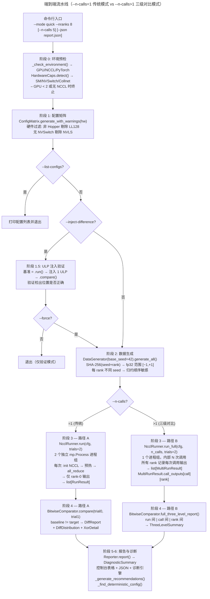
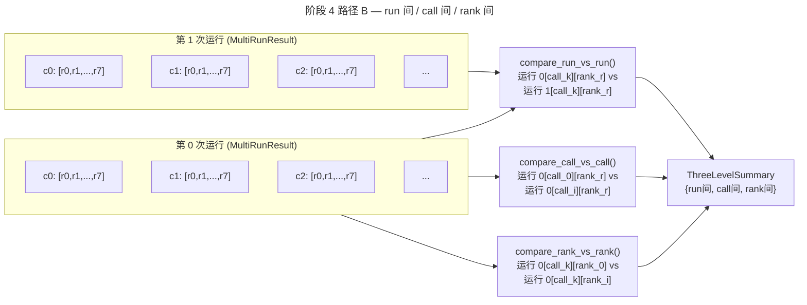

# 数据流图 — 全链路流水线

```mermaid
---
title: 端到端流水线（--n-calls=1 传统模式 vs --n-calls>1 三级对比模式）
---
flowchart TD
    CLI["命令行入口<br/>--mode quick --nranks 8<br/>[--n-calls 5] [--json report.json]"]
    
    CLI --> P0["阶段 0: 环境预检<br/>_check_environment() → GPU/NCCL/PyTorch<br/>HardwareCaps.detect() → SM/NVSwitch/Collnet<br/>⎯ GPU &lt; 2 或无 NCCL 时终止"]
    P0 --> P1["阶段 1: 配置矩阵<br/>ConfigMatrix.generate_with_warnings(hw)<br/>硬件过滤: 非 Hopper 剔除 LL128<br/>无 NVSwitch 剔除 NVLS"]
    P1 --> LIST{"--list-configs?"}
    LIST -->|是| EXIT0["打印配置列表并退出"]
    LIST -->|否| P1_5{"--inject-difference?"}

    P1_5 -->|是| INJ["阶段 1.5: ULP 注入验证<br/>基准 = .run() → 注入 1 ULP → .compare()<br/>验证检出位置是否正确"]
    INJ --> FORCE{"--force?"}
    FORCE -->|否| EXIT1["退出（仅验证模式）"]
    FORCE -->|是| P2
    
    P1_5 -->|否| P2["阶段 2: 数据生成<br/>DataGenerator(base_seed=42).generate_all()<br/>SHA-256(seed+rank) → fp32 范围 [−1,+1]<br/>每 rank 不同 seed → 归约顺序敏感"]
    
    P2 --> P3_BRANCH{"--n-calls?"}
    
    P3_BRANCH -->|"=1 (传统)"| P3A["阶段 3 — 路径 A<br/>NcclRunner.run(cfg, trials=2)<br/>2 个独立 mp.Process 进程组<br/>每次: init NCCL → 预热 → all_reduce<br/>→ 仅 rank-0 输出<br/>→ list[RunResult]"]
    
    P3_BRANCH -->|">1 (三级对比)"| P3B["阶段 3 — 路径 B<br/>NcclRunner.run_full(cfg, n_calls, trials=2)<br/>1 个进程组，内部 N 次调用<br/>所有 rank 记录每次调用输出<br/>→ list[MultiRunResult]<br/>MultiRunResult.call_outputs[call][rank]"]
    
    P3A --> P4A["阶段 4 — 路径 A<br/>BitwiseComparator.compare(trial0, trial1)<br/>baseline != target → DiffReport<br/>+ DiffDistribution + XorDetail"]
    
    P3B --> P4B["阶段 4 — 路径 B<br/>BitwiseComparator.full_three_level_report()<br/>run 间 | call 间 | rank 间<br/>→ ThreeLevelSummary"]
    
    P4A --> P5["阶段 5-6: 报告与诊断<br/>Reporter.report() → DiagnosticSummary<br/>控制台表格 + JSON + 诊断引擎<br/>_generate_recommendations()<br/>_find_deterministic_config()"]
    P4B --> P5
```

---

# 三级对比矩阵

```mermaid
---
title: 阶段 4 路径 B — run 间 / call 间 / rank 间
---
graph LR
    subgraph T0["第 0 次运行 (MultiRunResult)"]
        direction TB
        M0["c0: [r0,r1,...,r7]"]
        M1["c1: [r0,r1,...,r7]"]
        M2["c2: [r0,r1,...,r7]"]
        M3["..."]
    end
    
    subgraph T1["第 1 次运行 (MultiRunResult)"]
        direction TB
        N0["c0: [r0,r1,...,r7]"]
        N1["c1: [r0,r1,...,r7]"]
        N2["c2: [r0,r1,...,r7]"]
        N3["..."]
    end
    
    RUN["compare_run_vs_run()<br/>运行 0[call_k][rank_r] vs<br/>运行 1[call_k][rank_r]"]
    CALL["compare_call_vs_call()<br/>运行 0[call_0][rank_r] vs<br/>运行 0[call_i][rank_r]"]
    RANK["compare_rank_vs_rank()<br/>运行 0[call_k][rank_0] vs<br/>运行 0[call_k][rank_i]"]
    
    T0 --> RUN
    T1 --> RUN
    T0 --> CALL
    T0 --> RANK
    RUN --> T3["ThreeLevelSummary<br/>{run间, call间, rank间}"]
    CALL --> T3
    RANK --> T3
```
