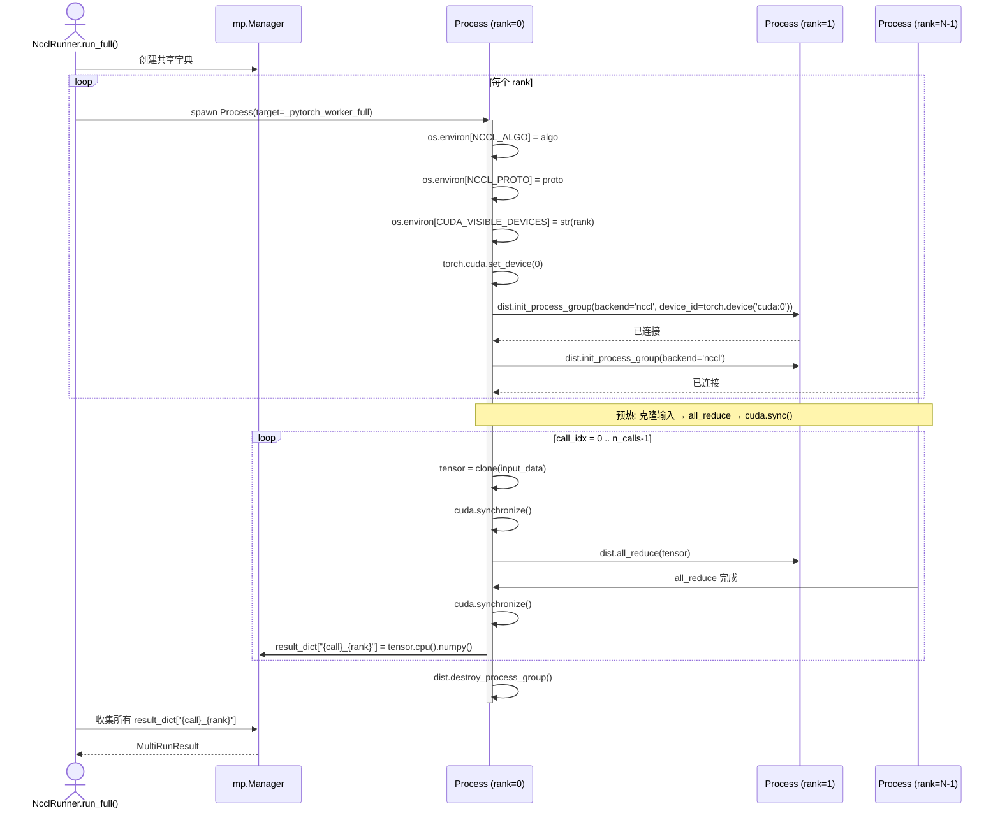
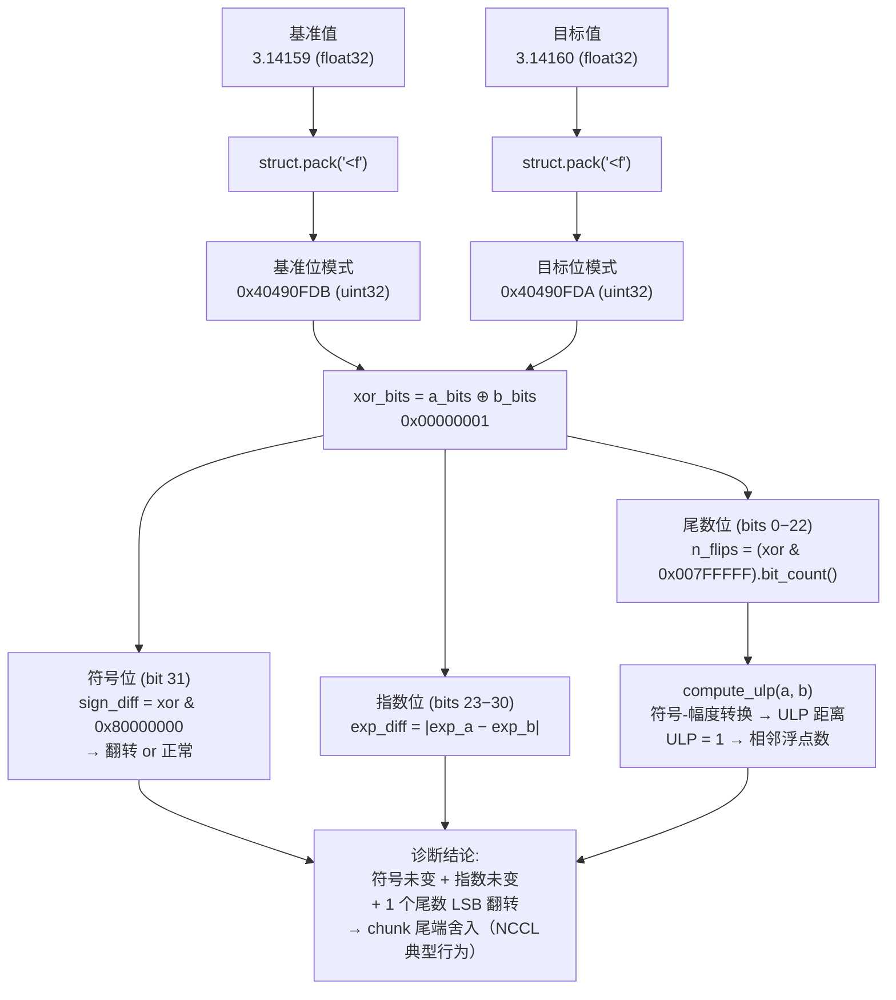

# Runner 进程模型 — _pytorch_worker_full()

```mermaid
sequenceDiagram
    actor Parent as NcclRunner.run_full()
    participant Manager as mp.Manager
    participant R0 as Process (rank=0)
    participant R1 as Process (rank=1)
    participant RN as Process (rank=N-1)
    
    Parent->>Manager: 创建共享字典
    
    loop 每个 rank
        Parent->>R0: spawn Process(target=_pytorch_worker_full)
        activate R0
        R0->>R0: os.environ[NCCL_ALGO] = algo
        R0->>R0: os.environ[NCCL_PROTO] = proto
        R0->>R0: os.environ[CUDA_VISIBLE_DEVICES] = str(rank)
        R0->>R0: torch.cuda.set_device(0)
        R0->>R1: dist.init_process_group(backend='nccl', device_id=torch.device('cuda:0'))
        R1-->>R0: 已连接
        R0->>R1: dist.init_process_group(backend='nccl')
        RN-->>R0: 已连接
    end
    
    Note over R0,RN: 预热: 克隆输入 → all_reduce → cuda.sync()
    
    loop call_idx = 0 .. n_calls-1
        R0->>R0: tensor = clone(input_data)
        R0->>R0: cuda.synchronize()
        R0->>R1: dist.all_reduce(tensor)
        RN->>R0: all_reduce 完成
        R0->>R0: cuda.synchronize()
        R0->>Manager: result_dict["{call}_{rank}"] = tensor.cpu().numpy()
    end
    
    R0->>R0: dist.destroy_process_group()
    deactivate R0
    
    Parent->>Manager: 收集所有 result_dict["{call}_{rank}"]
    Manager-->>Parent: MultiRunResult
```

---

# XOR / ULP 逐位分解

```mermaid
flowchart TD
    A["基准值<br/>3.14159 (float32)"] --> A1["struct.pack('&lt;f')"]
    B["目标值<br/>3.14160 (float32)"] --> B1["struct.pack('&lt;f')"]
    A1 --> ABITS["基准位模式<br/>0x40490FDB (uint32)"]
    B1 --> BBITS["目标位模式<br/>0x40490FDA (uint32)"]
    ABITS --> XOR["xor_bits = a_bits ⊕ b_bits<br/>0x00000001"]
    BBITS --> XOR
    XOR --> SIGN["符号位 (bit 31)<br/>sign_diff = xor &amp; 0x80000000<br/>→ 翻转 or 正常"]
    XOR --> EXP["指数位 (bits 23−30)<br/>exp_diff = |exp_a − exp_b|"]
    XOR --> MANT["尾数位 (bits 0−22)<br/>n_flips = (xor &amp; 0x007FFFFF).bit_count()"]
    MANT --> ULP["compute_ulp(a, b)<br/>符号-幅度转换 → ULP 距离<br/>ULP = 1 → 相邻浮点数"]
    SIGN --> INTERP["诊断结论:<br/>符号未变 + 指数未变<br/>+ 1 个尾数 LSB 翻转<br/>→ chunk 尾端舍入（NCCL 典型行为）"]
    EXP --> INTERP
    ULP --> INTERP
```
