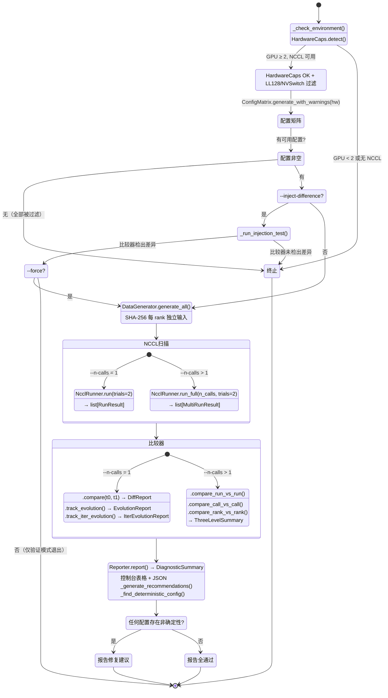

# 状态机 — diagnose.py main() 完整分支

```mermaid
stateDiagram-v2
    [*] --> 环境预检
    环境预检: _check_environment()
    环境预检: HardwareCaps.detect()
    
    环境预检 --> 硬件就绪: GPU ≥ 2, NCCL 可用
    环境预检 --> 终止: GPU < 2 或无 NCCL
    
    硬件就绪: HardwareCaps OK + LL128/NVSwitch 过滤
    硬件就绪 --> 配置矩阵: ConfigMatrix.generate_with_warnings(hw)
    
    配置矩阵 --> 配置非空: 有可用配置?
    配置非空 --> 终止: 无（全部被过滤）
    配置非空 --> 注入检查: 有
    
    注入检查: --inject-difference?
    注入检查 --> ULP注入验证: 是
    注入检查 --> 数据生成: 否
    
    ULP注入验证: _run_injection_test()
    ULP注入验证 --> 注入通过: 比较器检出差异
    ULP注入验证 --> 终止: 比较器未检出差异
    
    注入通过: --force?
    注入通过 --> 数据生成: 是
    注入通过 --> [*]: 否（仅验证模式退出）
    
    数据生成: DataGenerator.generate_all()
    数据生成: SHA-256 每 rank 独立输入
    
    数据生成 --> NCCL扫描
    
    state NCCL扫描 {
        [*] --> 传统模式: --n-calls = 1
        [*] --> 三级对比模式: --n-calls > 1
        传统模式: NcclRunner.run(trials=2)
        传统模式: → list[RunResult]
        三级对比模式: NcclRunner.run_full(n_calls, trials=2)
        三级对比模式: → list[MultiRunResult]
    }
    
    NCCL扫描 --> 比较器
    
    state 比较器 {
        [*] --> 传统比较: --n-calls = 1
        [*] --> 三级比较: --n-calls > 1
        传统比较: .compare(t0, t1) → DiffReport
        传统比较: .track_evolution() → EvolutionReport
        传统比较: .track_iter_evolution() → IterEvolutionReport
        三级比较: .compare_run_vs_run()
        三级比较: .compare_call_vs_call()
        三级比较: .compare_rank_vs_rank()
        三级比较: → ThreeLevelSummary
    }
    
    比较器 --> 报告器
    
    报告器: Reporter.report() → DiagnosticSummary
    报告器: 控制台表格 + JSON
    报告器: _generate_recommendations()
    报告器: _find_deterministic_config()
    
    报告器 --> 差异判断
    差异判断: 任何配置存在非确定性?
    差异判断 --> 报告修复建议: 是
    差异判断 --> 报告全通过: 否
    报告修复建议 --> [*]
    报告全通过 --> [*]
    
    终止 --> [*]
```
