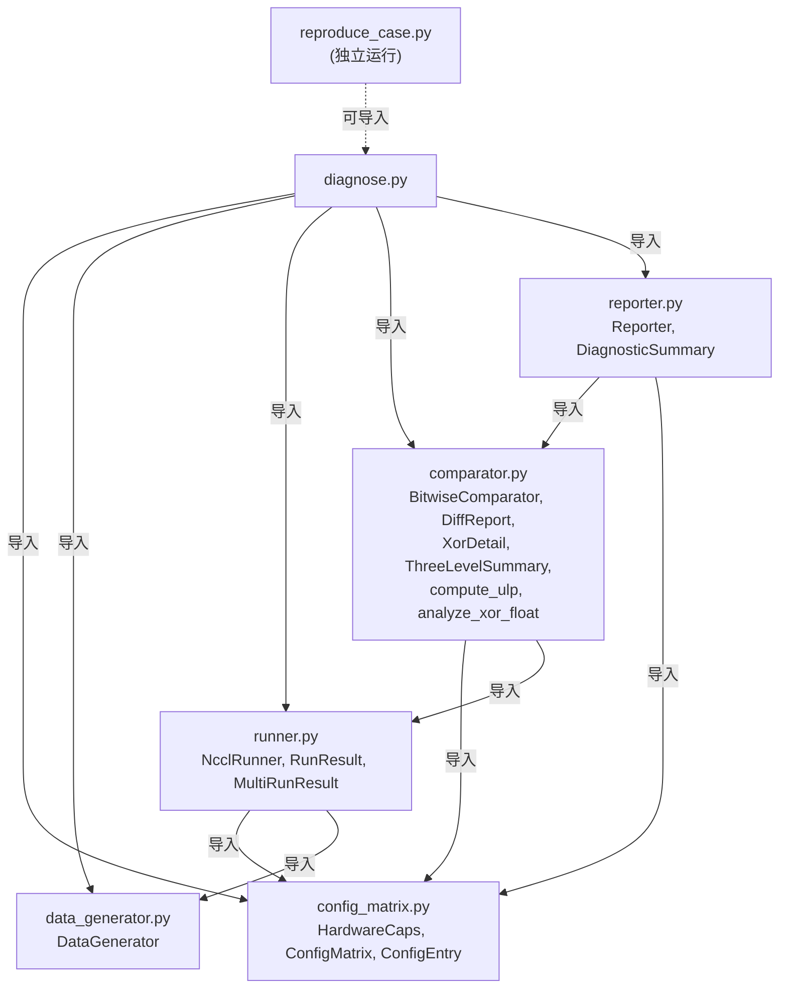

# 模块依赖图

```mermaid
graph TD
    diagnose["diagnose.py"] -->|导入| config_matrix["config_matrix.py<br/>HardwareCaps, ConfigMatrix, ConfigEntry"]
    diagnose -->|导入| data_generator["data_generator.py<br/>DataGenerator"]
    diagnose -->|导入| runner["runner.py<br/>NcclRunner, RunResult, MultiRunResult"]
    diagnose -->|导入| comparator["comparator.py<br/>BitwiseComparator, DiffReport,<br/>XorDetail, ThreeLevelSummary,<br/>compute_ulp, analyze_xor_float"]
    diagnose -->|导入| reporter["reporter.py<br/>Reporter, DiagnosticSummary"]
    
    runner -->|导入| config_matrix
    runner -->|导入| data_generator
    
    comparator -->|导入| config_matrix
    comparator -->|导入| runner
    
    reporter -->|导入| comparator
    reporter -->|导入| config_matrix
    
    reproduce_case["reproduce_case.py<br/>(独立运行)"] -.->|可导入| diagnose
```
